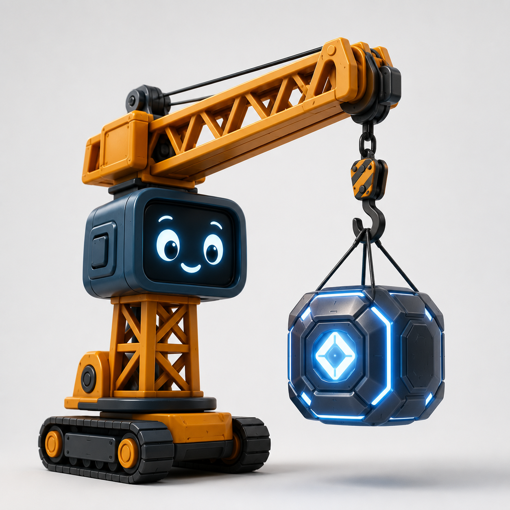

<p align="center">
  
</p>

<h1 align="center">Crane Harness</h1>

<p align="center">
  <strong>A model-independent runtime for AI agents.</strong>
  <br>
  It owns the lifecycle. The model is one replaceable part.
</p>

<p align="center">
  <a href="#requirements">
    
  </a>
  <a href="https://docs.pydantic.dev/">
    
  </a>
  <a href="https://react.dev/">
    
  </a>
  <a href="https://v2.tauri.app/">
    
  </a>
  <a href="LICENSE">
    
  </a>
  <a href="#why-crane-harness-exists">
    
  </a>
</p>

> Crane Harness does not require an AI model to run.

This project is an early working prototype. It currently uses a fake model so
we can build and test the harness before adding a model provider.

The project was recently named Crane Harness. Some internal package names,
paths, and environment variables still use `agent-loop`. They will be renamed
in a separate change. This README uses the current technical names where a
command depends on them.

## Why Crane Harness exists

Many agent libraries begin with a model API. They add tools, memory, queues,
and recovery around that API.

Crane Harness begins with the application:

- A **Message** contains a sender, text, and attachments.
- The **Inbox** keeps new user messages in order.
- The **Thread** keeps the conversation history.
- The **Agent Loop** moves work forward at safe checkpoints.
- A **Model Adapter** connects a model when the application needs one.

The harness owns these rules. OpenAI, Anthropic, Gemini, or a local model does
not own them.

## What works today

Crane Harness can already:

- accept user messages while a turn is running;
- keep those messages in a first-in, first-out Inbox;
- join queued messages into one clear message at the next safe checkpoint;
- keep the complete user and assistant history;
- save Inbox and Thread changes in an append-only file;
- recover unfinished work after a restart;
- reject an old model response after the user clears the runtime;
- run without a real AI provider;
- run as a headless Python process; and
- run as a Tauri desktop application with a React interface.

The fake model waits five seconds before it replies. This delay is intentional.
It makes it easy to test messages that arrive during an active turn.

## The loop in plain language

```text
1. A user sends a message.
2. Crane saves the message in the Inbox.
3. The loop reaches a safe checkpoint.
4. Crane moves the waiting Inbox messages into the Thread.
5. A model adapter receives the Thread.
6. Crane saves the assistant response.
7. The loop checks the Inbox again.
```

The Inbox can receive more messages during step 5. Crane does not lose them or
change the active model input. It waits for the next safe checkpoint.

For example, a user may send three separate messages:

```text
Check the tests
Do not change the UI
Tell me what failed
```

At the next checkpoint, Crane sends one message to the model:

```text
Check the tests. Do not change the UI. Tell me what failed
```

The original messages remain separate in the journal. Only the model input is
joined.

## Runtime state

The control surface receives one complete snapshot of the runtime:

```json
{
  "epoch": 4,
  "revision": 9,
  "status": "idle",
  "inbox": {
    "messages": []
  },
  "thread": {
    "messages": [
      {
        "sender": "user",
        "message": "Hello",
        "attachments": []
      },
      {
        "sender": "assistant",
        "message": "The loop is alive.",
        "attachments": []
      }
    ]
  }
}
```

- **epoch** changes when the runtime is cleared. It protects the new Thread
  from an old model response.
- **revision** changes after each saved event. It shows which snapshot is
  newer.
- **status** is `idle` or `running`.
- **inbox** contains user messages waiting for a safe checkpoint.
- **thread** contains the ordered conversation history.

## Requirements

For the headless Python runtime:

- Python 3.12 or newer

For the desktop application:

- Python 3.12 or newer
- Node.js 22.12 or newer
- the stable Rust toolchain

Rust is used by Tauri. You do not need Rust to work on the Python runtime.

## Install

Create the Python environment from the repository root:

```sh
python3 -m venv venv
source venv/bin/activate
python -m pip install -r requirements.txt
```

For development, install the test, formatting, lint, type-checking, and
packaging tools:

```sh
python -m pip install -r requirements.dev.txt
```

On Windows PowerShell, activate the environment with:

```powershell
venv\Scripts\Activate.ps1
```

Install the desktop dependencies:

```sh
cd src/control/tauri-react
npm install
```

## Run the desktop application

From the repository root:

```sh
./bin/start.sh
```

The script starts the React development server, the Tauri window, and the
Python runtime. Tauri reloads the interface when React files change. Changes
to the Python runtime restart the Tauri development process.

Enter `/clear` in the message box to clear the Inbox and Thread.

## Run without the desktop application

Start the newline-delimited JSON-RPC process:

```sh
python main.py
```

Send one JSON object per line through standard input. Crane writes responses
and runtime snapshot notifications to standard output.

Supported methods:

| Method | Purpose |
| --- | --- |
| `runtime.ping` | Check whether the runtime is ready. |
| `runtime.get` | Read the complete runtime snapshot. |
| `message.add` | Add one user message to the Inbox. |
| `thread.clear` | Clear the Inbox and Thread. |

The headless runtime saves its journal to `data/thread.jsonl` by default. Set
`AGENT_LOOP_THREAD_PATH` to use another file.

## Run only the React interface

The browser development mode uses an in-memory copy of the loop. It does not
start Python, Rust, or Tauri.

```sh
cd src/control/tauri-react
npm run dev
```

Use this mode for quick interface work. Use `./bin/start.sh` when testing the
real desktop lifecycle and filesystem journal.

## Architecture

Crane Harness follows domain-driven design. Dependencies point toward the
domain.

```text
Control
  React and Tauri
        |
        v
Application
  use cases, ports, and the agent loop
        |
        v
Domain
  Message, Inbox, Thread, RuntimeSnapshot
        ^
        |
Infrastructure
  filesystem journal, fake model, runtime host
```

### Domain

The domain contains immutable Pydantic models and their rules. It does not
know about React, Tauri, filesystems, or model providers.

### Application

The application contains use cases and ports. It decides when work may enter
the Thread and when a model may run.

### Infrastructure

Infrastructure implements the application ports. The current adapters provide
filesystem persistence, snapshot publishing, and a fake model.

### Control

The Python sidecar exposes the application through JSON-RPC. Rust owns the
sidecar process. React renders runtime snapshots and sends commands.

Read [Model providers](resources/model-providers/README.md) for the provider
adapter rules.

## Persistence and recovery

Inbox and Thread changes use one append-only JSON Lines journal.

A turn has two durable boundaries:

1. `turn_started` saves the user message before the model runs.
2. `assistant_completed` saves the assistant message after the model returns.

If the application stops between these events, Crane can replay the journal
and continue the unfinished turn.

Each newline commits one complete journal event. Crane ignores an incomplete
final line after an interrupted write. It removes that line before the next
event is saved.

If a model call fails, Crane reports the error and keeps the unfinished turn.
The runtime tries that turn again the next time it is awakened.

The `/clear` command starts a new epoch. A response from an older epoch cannot
write into the new Thread.

## Verify changes

Format and check every Python file from the repository root:

```sh
python -m black .
python -m ruff check .
python -m mypy
python -m pytest
```

Run the React tests and production build:

```sh
cd src/control/tauri-react
npm test
npm run build
```

Run the Rust tests and checks:

```sh
cd src/control/tauri-react/src-tauri
cargo test
cargo check
```

Build the bundled Python sidecar:

```sh
cd src/control/tauri-react
npm run sidecar:build
```

## Build a desktop installer

```sh
cd src/control/tauri-react
npm run tauri build
```

Build macOS packages on macOS and Windows packages on Windows. Public releases
will also need code signing, notarization, and an update process.

## Project status

Crane Harness is not ready for production use.

It does not yet include:

- a real model provider;
- tool calls and tool results;
- approval and permission policies;
- multiple Threads;
- a stable public history format; or
- signed public desktop releases.

These features will be added through domain and application boundaries. Model
provider details will stay inside provider adapters.

## Contributing

Contributions are welcome while the project is taking shape.

Please keep changes small and easy to review:

1. Explain the behavior that needs to change.
2. Keep domain rules independent from providers and interfaces.
3. Add tests for new behavior.
4. Run the relevant verification commands.
5. Describe what changed and why.

Use clear language in code, tests, issues, and documentation. A reader should
not need expert AI knowledge to understand the change.

## License

Crane Harness is open-source software available under the
[Apache License 2.0](LICENSE).
